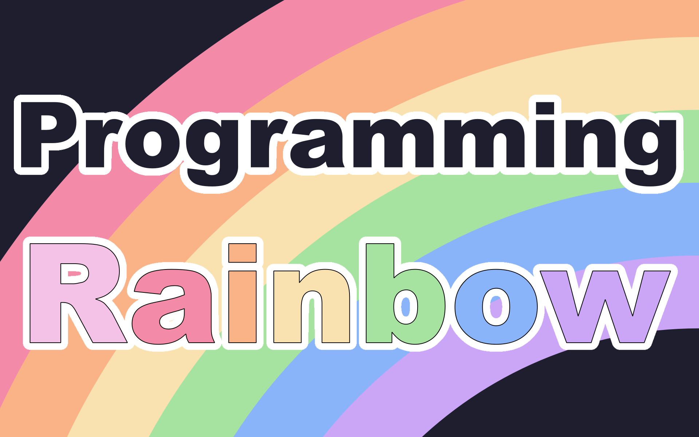

# Programming Rainbow Index

## Beginners Guide
[Beginners Guide to SDL2 in C](https://github.com/ProgrammingRainbow/Beginners-Guide-to-SDL2-in-C)\
[Beginners Guide to SDL3 in C](https://github.com/ProgrammingRainbow/Beginners-Guide-to-SDL3-in-C)\
[Beginners Guide to SDL2 in COBOL](https://github.com/ProgrammingRainbow/Beginners-Guide-to-SDL2-in-COBOL)\
[Beginners Guide to SDL2 in Cpp](https://github.com/ProgrammingRainbow/Beginners-Guide-to-SDL2-in-Cpp)\
[Beginners Guide to SDL3 in Cpp](https://github.com/ProgrammingRainbow/Beginners-Guide-to-SDL3-in-Cpp)
[Beginners Guide to SDL2 in Gforth](https://github.com/ProgrammingRainbow/Beginners-Guide-to-SDL2-in-Gforth)\
[Beginners Guide to SDL2 in Go](https://github.com/ProgrammingRainbow/Beginners-Guide-to-SDL2-in-Go)\
[Beginners Guide to SDL2 in Haskell](https://github.com/ProgrammingRainbow/Beginners-Guide-to-SDL2-in-Haskell)\
[Beginners Guide to Love2D](https://github.com/ProgrammingRainbow/Beginners-Guide-to-Love2D)\
[Beginners Guide to SDL2 in Odin](https://github.com/ProgrammingRainbow/Beginners-Guide-to-SDL2-in-Odin)\
[Beginners Guide to Pygame](https://github.com/ProgrammingRainbow/Beginners-Guide-to-Pygame)\
[Beginners Guide to Pygame Zero](https://github.com/ProgrammingRainbow/Beginners-Guide-to-Pygame-Zero)\
[Beginners Guide to Gosu in Ruby](https://github.com/ProgrammingRainbow/Beginners-Guide-to-Gosu-in-Ruby)

## Don't Eat the Yellow Snow
[Yellow Snow - C - SDL2](https://github.com/ProgrammingRainbow/Yellow-Snow-C-SDL2)\
[Yellow Snow - Cpp - SDL2](https://github.com/ProgrammingRainbow/Yellow-Snow-Cpp-SDL2)\
[Yellow Snow - Haskell - SDL2](https://github.com/ProgrammingRainbow/Yellow-Snow-Haskell-SDL2)\
[Yellow Snow - Lua - Love2D](https://github.com/ProgrammingRainbow/Yellow-Snow-Lua-Love2D)\
[Yellow Snow - Odin - SDL2](https://github.com/ProgrammingRainbow/Yellow-Snow-Odin-SDL2)

## Super Clock
[Super Clock - C - SDL2](https://github.com/ProgrammingRainbow/Super-Clock-C-SDL2)\
[Super Clock - Cpp - SDL2](https://github.com/ProgrammingRainbow/Super-Clock-Cpp-SDL2)\
[Super Clock Love2D](https://github.com/ProgrammingRainbow/Super-Clock-Love2D)

## Conway's Game of Life
[Conway's Game of Life - C - SDL2](https://github.com/ProgrammingRainbow/Conways-Game-of-Life-C-SDL2)\
[Conway's Game of Life - C - SDL3](https://github.com/ProgrammingRainbow/Conways-Game-of-Life-C-SDL3)\
[Conway's Game of Life - Cpp - SDL2](https://github.com/ProgrammingRainbow/Conways-Game-of-Life-Cpp-SDL2)\
[Conway's Game of Life - Cpp - SDL3](https://github.com/ProgrammingRainbow/Conways-Game-of-Life-Cpp-SDL3)\
[Conway's Game of Life - Love2D](https://github.com/ProgrammingRainbow/Conways-Game-of-Life-Love2D)\
[Conway's Game of Life - Odin - SDL2](https://github.com/ProgrammingRainbow/Conways-Game-of-Life-Odin-SDL2)
